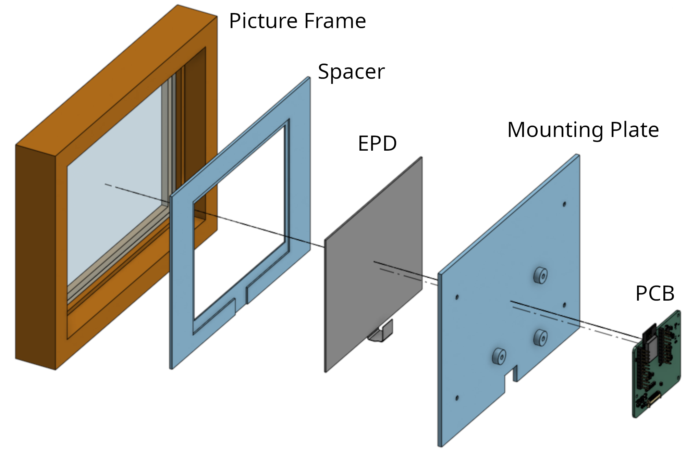

# You'd Better Run!

This project lets you know if you can walk leisurely to catch the bus, or if you'd better run.

This is a screen that hangs on the wall by the door to at a glance see how much time you have to get to the bus stop.

This repository holds the 3D models and assembly instructions.
There are separate repositories for the PCB and firmware models.
- [Firmware](https://github.com/youdbetterrun/youdbetterrun-firmware): The code that runs on the microcontroller.
- [PCB](https://github.com/youdbetterrun/youdbetterrun-pcb): The design files for the printed circuit board.

## Bill Of Materials

| Item                   | Quantity | Source                                                                                                                             |
| ---------------------- | -------- | ---------------------------------------------------------------------------------------------------------------------------------- |
| Picture Frame          |        1 | https://www.ikea.com/ca/en/p/roedalm-frame-oak-effect-10566390/ (It should be easy to adapt the 3D printing files for other sizes) |
| Spacer                 |        1 | 3D printed                                                                                                                         |
| Mounting Plate         |        1 | 3D printed                                                                                                                         |
| PCB                    |        1 | [sister repository](https://github.com/youdbetterrun/youdbetterrun-pcb)                                                            |
| M3x6mm BHCS            |        3 | Hardware store                                                                                                                     |
| M3x3mm heat set insert |        3 | https://cnckitchen.store/products/heat-set-insert-m3-x-3-short-version-100-pieces                                                  |
| Hooks                  |          | TODO When I'm back from Christmas vacation                                                                                         |

## Assembly Instructions

The image below shows the exploded view of the assembly.

